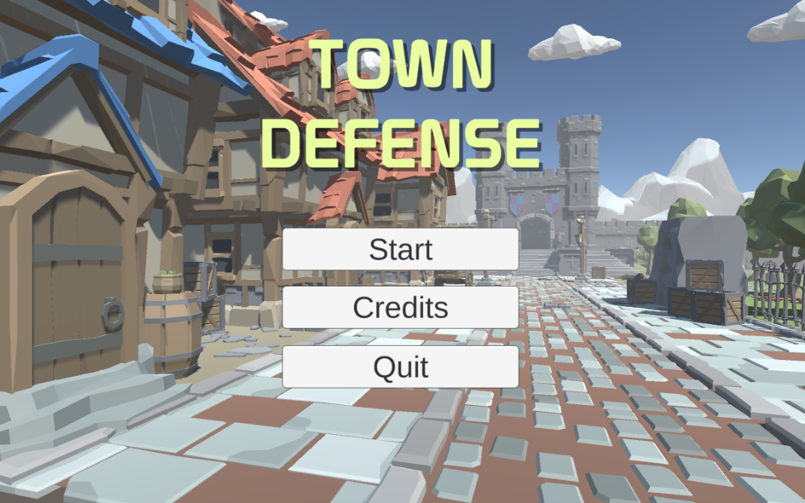
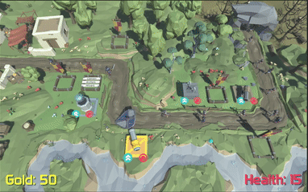
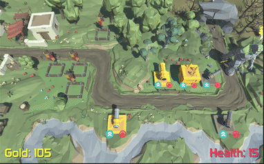

# Town Defense

Protect the town from an invasion from bandits, rebels, and forest monsters. You can pgrade your defenses after every invasion to prepare for the next one. As their force get stronger, yours will too. Town Defense is a game that was made with Unity using C#.

There will be 10 stages in total and one unique boss for each stage starting with the Ancient Golem.

Three basic towers:
- Cannon - Deals high damage but slow
- Archers - Has fast attack speed and good range
- Wizard Tower - Does lightning chain attack that damages multiple enemies as once
- Spike trap - Deals steady damages on enemies walking over it

